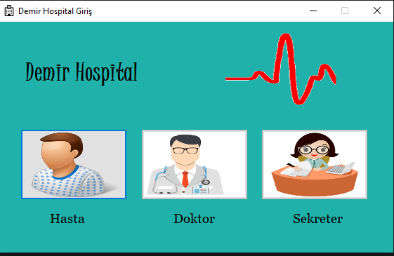
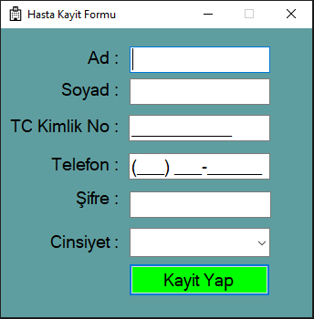
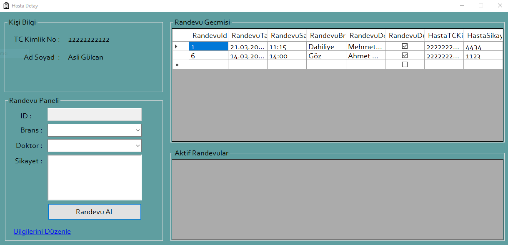

# 🏥 Hastane Yönetim ve Randevu Otomasyon Sistemi

🔧 Bu proje, **C# Windows Forms ve SQL Server** kullanılarak geliştirilen kapsamlı bir hastane bilgi yönetim sistemidir. 
Hasta işlemleri, doktor atamaları, branş ve randevu modülleriyle birlikte, tam anlamıyla bir dijital hastane altyapısı sunar.  
🚀 Proje özellikle yazılım ders projeleri, staj sunumları veya teknik portföy amacıyla geliştirilmiştir.

---

## 📌 GitHub Açıklaması İçin Kısa Tanım

> Tamamen C# Windows Forms ile geliştirilmiş, SQL Server veritabanı destekli bir hastane otomasyon projesidir.  
Hasta kaydı, doktor eşleştirme, randevu yönetimi gibi temel işlevleri içerir.  
Projede .mdf ile doğrudan veritabanı bağlantısı ve alternatif olarak SQL script ile kurulum mümkündür.

---

## 🚀 Proje Özellikleri

- 👤 Hasta kayıt, güncelleme ve silme
- 📅 Doktor ekleme ve randevu planlama
- 🧾 Branş yönetimi
- 🗂️ SQL Server veritabanı bağlantısı (MDF ve script destekli)
- 🔐 Giriş paneli (Admin & Sekreter)
- 🖥️ Temiz ve kullanıcı dostu arayüz

---

## 📁 Proje Yapısı

```
📦 HastaneYonetimveRandevuSistemiOtomasyonProjesi
├── HastaneYonetimveRandevuSistemiOtomasyonProjesi.sln
├── HastaneProje.mdf
├── HastaneProje_log.ldf
├── HastaneDB.sql
├── /HastaneYonetimveRandevuSistemiOtomasyonProjesi
```

---

## 🛠️ Veritabanı Bağlantısı (Attach Yöntemi)

### SQL Server Management Studio (SSMS) üzerinden .mdf dosyasını bağlama:

1. SSMS'yi **Yönetici olarak** çalıştır.
2. Sol menüde `Databases` üzerine sağ tıkla → `Attach...`
3. Açılan pencerede `Add...` butonuna tıkla.
4. Proje dizinindeki **HastaneProje.mdf** dosyasını seç → OK.
5. `.ldf` dosyası otomatik eklenecek. Yine OK diyerek tamamla.
6. Artık veritabanın SSMS içinde kullanılabilir.

> **Hata alırsan:** Dosyaları `C:\Program Files\Microsoft SQL Server\MSSQL15.SQLEXPRESS\MSSQL\DATA` klasörüne taşı ve tekrar dene.

---

## 🔗 SQL Kodlarını Manuel Çalıştırmak İçin:

1. SSMS → `New Query`
2. `HastaneDB.sql` içeriğini aç
3. `USE master` satırı varsa yorum satırı yap (`--USE master`)
4. `F5` tuşu ile çalıştır → Veritabanı ve tablolar oluşturulur

---

## 🖼️ Uygulama Görselleri

### 🔑 Giriş Paneli



### 📋 Hasta Kayıt Formu



### 📅 Randevu Paneli



---

## 💡 Gereksinimler

- Visual Studio 2019 / 2022
- .NET Framework 4.7.2+
- SQL Server Express (SQLEXPRESS önerilir)
- SSMS (SQL Server Management Studio)

---

## 👨‍💻 Hazırlayan

> Bu proje, yazılım geliştirme becerilerini göstermek ve **ders geçiş** amacıyla [Erdinç](https://github.com/DmrErdinc) tarafından hazırlanmıştır.

---

📌 *Sağlık dijitalleşiyor, veriler düzenleniyor!*
